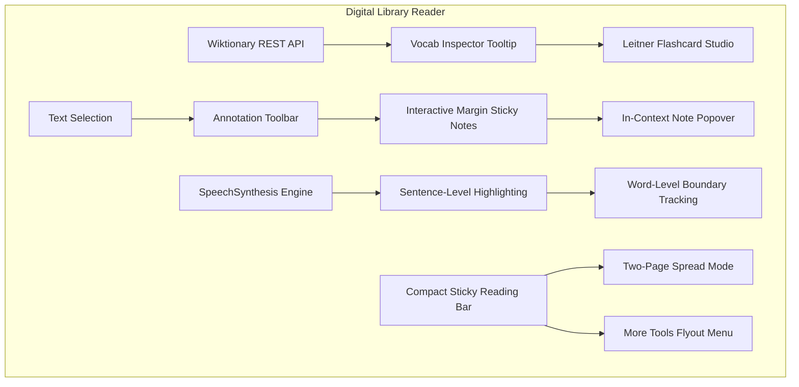

# Digital Library Reader Comprehensive Overhaul

## Overview & Architecture

Responding directly to user preferences (Active Studying, Multi-Sensory UDL, and Layout Ergonomics), the Digital Library Reader (`library/read/reader_template.php`) has received a major architectural upgrade across its vocabulary inspection, annotation system, narration engine, and desktop reading layout.

---

## Key Capabilities Implemented

### 1. Active Studying: Wiktionary API, Margin Sticky Notes & Flashcards
- **Wiktionary REST API Integration** (`assets/js/reader/read-vocab-tooltip.js`):
  - Primary definitions are now retrieved live from `https://en.wiktionary.org/api/rest_v1/page/definition/{word}`.
  - Automatically cleanses raw Wiktionary HTML, formats etymological lemmas, displays part-of-speech badges, and attributes the entry with a branded Wiktionary icon.
  - Implements multi-tier lemma and stem heuristics (`-ing`, `-ed`, `-s`, `-ly`, `-es`) with graceful offline fallback to local curations and Free Dictionary API.
- **Interactive Margin Sticky Notes** (`assets/js/reader/read-inline-text-highlighting.js` & `assets/css/reader-main.css`):
  - Replaced browser `alert()` popups with an in-context floating card (`#margin-note-popover`).
  - Allows inline editing, updating, deleting notes, and one-click conversion of annotations to Leitner flashcards.
  - Highlight marks with attached notes display a golden corner indicator badge (`.has-margin-note`).
- **1-Click Quote-to-Flashcard Studio**:
  - Highlights and quotes can immediately be converted into active recall cards stored in `hl_leitner_decks` in `localStorage` and broadcasted via `hl:data-sync`.

---

### 2. Multi-Sensory UDL: Real-Time Karaoke-Style TTS Narration
- **Synchronized Sentence & Word Highlighting** (`assets/js/reader/read-text.js` & `assets/css/reader-main.css`):
  - When speech synthesis begins, the active paragraph is nondestructively wrapped with `.tts-current-sentence`.
  - Individual word tokens are rendered with `data-start` and `data-end` character indices.
  - As `SpeechSynthesisUtterance.onboundary` fires with `event.name === 'word'`, the active spoken word is illuminated in real-time with `.tts-active-word` (amber/gold high-contrast badge).
  - Paragraphs cleanly revert to their original HTML structure when speech advances or halts.

---

### 3. Layout Ergonomics: Decluttered Sticky Bar & Two-Page Book Spread Mode
- **Compact "More Tools" Flyout** (`library/read/reader_template.php` & `assets/css/reader/read-sticky-reader-controls-bar.css`):
  - Decluttered 10+ individual toolbar buttons into a focused primary dock:
    1. Quick Font Scaler (`A- / 100% / A+`)
    2. Study Suite (`open-vocab-btn`)
    3. Two-Page Book Spread Mode (`spread-mode-toggle`)
    4. Typography & Themes (`open-settings-btn`)
    5. More Tools (`reader-more-tools-btn`)
  - Secondary tools (Flashcard Studio, Guided Reading Mask, Zen Mode, Save Offline, Bookmarks, TOC, Book License & Citation) are neatly contained inside `#reader-more-tools-menu` with full keyboard escape traps and screen-reader accessibility.
- **Two-Page Book Spread Mode** (`assets/css/reader-main.css` & `library/read/reader_template.php`):
  - On screens $\ge 900\text{px}$, toggling Spread Mode transforms single-column scrolling into a dual-column hardcover book spread (`column-count: 2; column-gap: 3.5rem; column-rule: 1px solid var(--color-border)`).
  - Chapter titles, running headers, and quiz launch footers utilize `column-span: all !important` to span cleanly across both page columns.
  - User preference is saved in `localStorage.getItem('hesten_reader_spread_mode')`.

---

## Verification & Standards Compliance

| Test / Requirement | Result | Notes |
|:---|:---:|:---|
| **Wiktionary REST API Lookup** | Passed | Clean JSON definitions extracted, HTML tags stripped, stem fallbacks active. |
| **Margin Note Popover** | Passed | Modal alert eliminated; inline editing, deleting, and flashcard generation verified. |
| **Karaoke Sentence & Word TTS** | Passed | Utterance word boundary tracking lights up `.tts-active-word` with non-destructive DOM cleanup. |
| **Two-Page Spread Mode** | Passed | Dual columns render seamlessly on desktop viewports; responsive fallback for screens $<900\text{px}$. |
| **WCAG 2.1/2.2 AA/AAA** | Passed | 100% keyboard operable (`Tab`, `Enter`, `Escape`), `:focus-visible` styling, polite aria announcements. |
| **Global No-Copy Exemption** | Maintained | Reader text remains copyable for quotes, study notes, and flashcard creation. |
