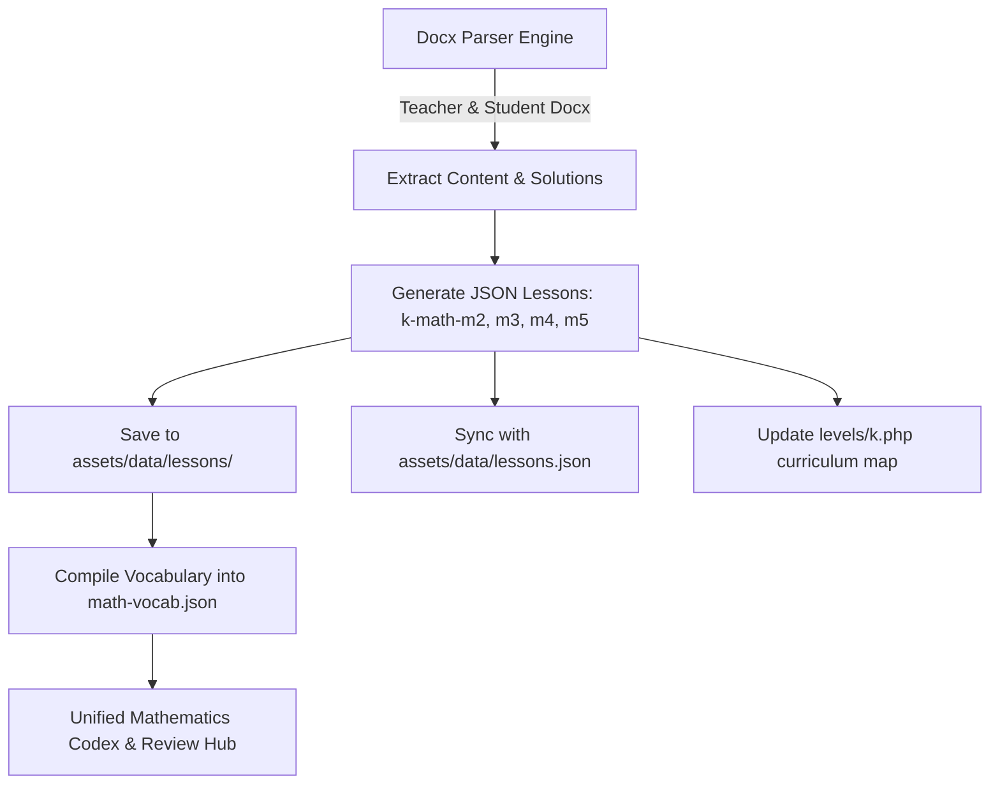

# Implementation Plan: Complete Buildout of Grade 9 Math Modules 2–5 & Codex Integration

## 1. Executive Summary & Objective

In accordance with user directives:
1. Merge `/pages/math.php` into `pages/math-vocab.php` so all mathematical codex definitions, formulas, procedures, and interactive sandboxes reside in a unified hub.
2. Build out the entirety of **Grade 9 Algebra I Modules 2, 3, 4, and 5** (77 lessons total) using the authentic teacher and student `.docx` source materials in `assets/Module 2`, `assets/Module 3`, `assets/Module 4`, and `assets/Module 5`, mirroring the rigorous standard established in Module 1.

---

## 2. Curriculum Inventory & Scope

| Module | Title | Topics & Lessons | Target Lesson IDs |
|--------|-------|------------------|-------------------|
| **Module 2** | Descriptive Statistics | Topic A: Lessons 1–3 Topic B: Lessons 4–8 Topic C: Lessons 9–11 Topic D: Lessons 12–20 | `k-math-m2-a-1` to `a-3` `k-math-m2-b-1` to `b-5` `k-math-m2-c-1` to `c-3` `k-math-m2-d-1` to `d-9` (20 lessons) |
| **Module 3** | Linear & Exponential Functions | Topic A: Lessons 1–7 Topic B: Lessons 8–14 Topic C: Lessons 15–20 Topic D: Lessons 21–24 | `k-math-m3-a-1` to `a-7` `k-math-m3-b-1` to `b-7` `k-math-m3-c-1` to `c-6` `k-math-m3-d-1` to `d-4` (24 lessons) |
| **Module 4** | Polynomial & Quadratic Expressions, Equations & Functions | Topic A: Lessons 1–10 Topic B: Lessons 11–17 Topic C: Lessons 18–24 | `k-math-m4-a-1` to `a-10` `k-math-m4-b-1` to `b-7` `k-math-m4-c-1` to `c-7` (24 lessons) |
| **Module 5** | Synthesis of Modeling with Equations & Functions | Topic A: Lessons 1–3 Topic B: Lessons 4–9 | `k-math-m5-a-1` to `a-3` `k-math-m5-b-1` to `b-6` (9 lessons) |
| **Total** | **Grade 9 Modules 2–5** | **77 Lessons** | **77 Dedicated JSON Files** |

Combined with Module 1 (28 lessons), this completes the entire **105-lesson Grade 9 Algebra I curriculum**.

---

## 3. Lesson Component Specifications

Every lesson JSON file in `assets/data/lessons/` will strictly implement:
1. **Metadata & Standards**:
   - Canonical lesson identifiers, CCSS standard codes, titles, and mathematical badges.
2. **Student & Teacher Overview**:
   - Contextual overview text, bulleted Student Outcomes, and pedagogical Teacher Insights.
3. **Curriculum Vocabulary**:
   - Domain-specific terms and definitions extracted directly from lesson texts.
4. **Multi-Step Guided Exercises**:
   - Classroom exploration problems with worked step-by-step teacher solutions, scaffolding hints, final answers, and Common Pitfall alerts.
5. **Embedded Official Problem Sets**:
   - Complete student practice exercises.
   - Expandable teacher solution keys with full step-by-step mathematical work.
   - 1-click browser printing (`printProblemSet()`).
   - Zero external download links.
6. **Verbatim Exit Ticket Keys (Check Understanding)**:
   - Authentic Exit Ticket assessment prompts and teacher answer keys.

---

## 4. Execution Workflow

### Proposed Steps:
1. **Develop Comprehensive Docx Extraction Engine**:
   - Write `scratch/build_modules_2_5.py` to parse all 77 teacher and student docx pairs.
   - Extract title, outcomes, notes, classwork, problem sets, and exit tickets.
2. **Generate All 77 JSON Lessons**:
   - Write validated JSON files to `assets/data/lessons/k-math-m{2..5}-*.json`.
3. **Synchronize Master Datasets**:
   - Merge all 77 lessons into `assets/data/lessons.json`.
   - Update `levels/k.php` curriculum map to ensure all 105 lessons are linked with correct titles and codes.
4. **Compile Unified Math Vocabulary**:
   - Re-run `scratch/compile_math_vocab.py` to index all new vocabulary from Modules 2–5 into `assets/data/math-vocab.json`.
5. **Documentation & Release Notes**:
   - Bump platform version to `v2.8.0` in `src/header.php` and `src/footer.php`.
   - Create Help Center guide and walkthrough document.
