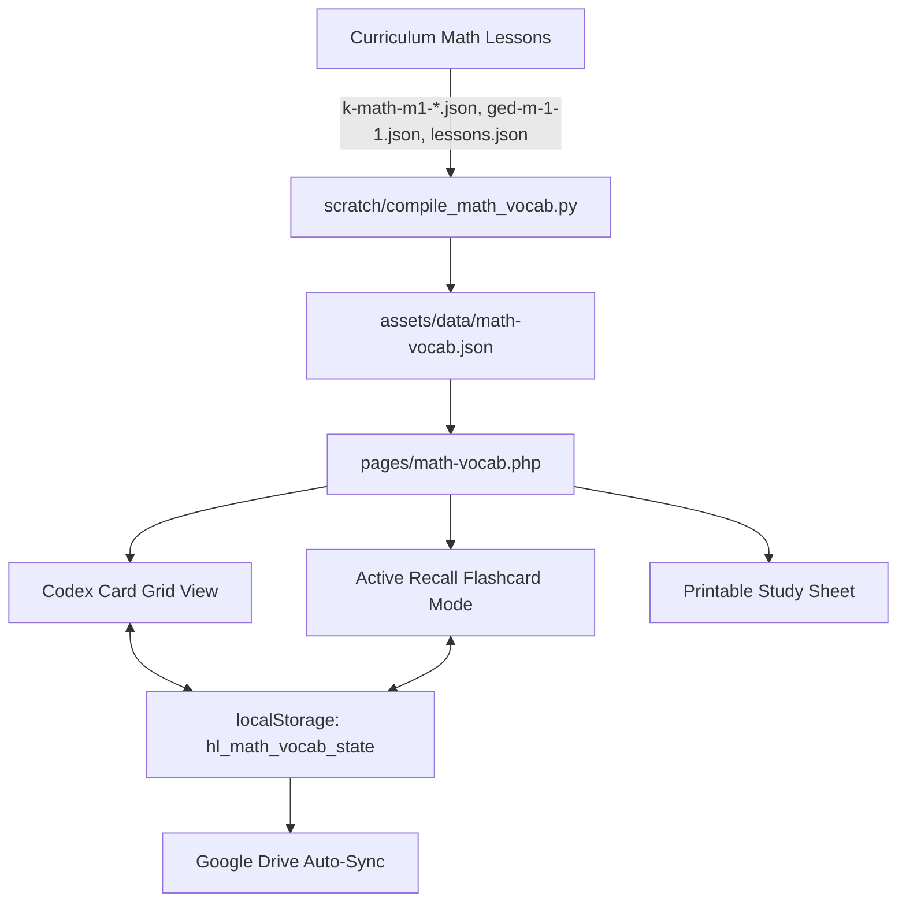

# Implementation Plan: Universal Math Vocabulary Review Portal (`pages/math-vocab.php`)

## 1. Executive Summary & Objective
Create a dedicated Mathematics Vocabulary Review Portal at [`pages/math-vocab.php`](file:///c:/Users/Heste/OneDrive/Documents/_legacy_backup/pages/math-vocab.php) where all mathematical terminology, formal definitions, symbolic notations, and examples from across the platform's math curriculum reside in a centralized, searchable, and interactive repository for user review.

The portal provides two synchronized study modes:
1. **Codex Grid View**: An encyclopedic card concordance with sticky A–Z alphabetical jump ribbon, live multi-field search, curriculum domain filters, speech audio pronunciation, and direct links to originating lessons.
2. **Active Recall Flashcard Mode**: A 3D flip-card study interface with keyboard controls (`Space` to flip, `ArrowRight`/`ArrowLeft` to navigate), card shuffle, mastery categorization ("Mastered" vs "Needs Practice"), and persistent progress tracking via `localStorage`.

---

## 2. Architecture & Data Pipeline



### A. Data Schema (`assets/data/math-vocab.json`)
Each entry adheres to the following structure:
```json
{
  "id": "piecewise-linear-function",
  "term": "Piecewise Linear Function",
  "definition": "A function whose domain is partitioned into intervals where the function is defined by a distinct linear expression on each sub-interval.",
  "example": "$f(x) = \\begin{cases} 2x + 1 & x < 0 \\\\ -x + 1 & x \\ge 0 \\end{cases}$",
  "category": "Linear & Piecewise Functions",
  "modules": ["Module 1: Relationships Between Quantities & Reasoning with Equations"],
  "grades": ["Grade 9"],
  "lessons": [
    {
      "id": "k-math-m1-a-1",
      "title": "Graphs of Piecewise Linear Functions",
      "url": "/levels/k.php?k-math-m1-a-1"
    }
  ],
  "standards": ["HSF-IF.B.4", "HSF-IF.C.7b"]
}
```

---

## 3. UI/UX & Interactive Capabilities

1. **Dual-Mode View Switcher**:
   - `Codex Grid`: Searchable, filterable card catalog with full details visible.
   - `Flashcard Studio`: Interactive 3D flip card with question on front, definition and formula on back, self-assessment buttons ("Mastered", "Needs Review", "Star").
2. **Multi-Faceted Filtering & Navigation**:
   - **Live Instant Search**: Queries term, definition, keywords, standards, and originating lessons.
   - **Sticky A–Z Ribbon**: Direct anchor jumps to alphabetical groupings.
   - **Domain Filter Pills**: Linear & Piecewise Functions, Equations & Inequalities, Quadratic Functions, Exponential Functions, Descriptive Statistics, etc.
   - **Mastery Queue Filters**: "All Words", "Starred", "Needs Practice", "Mastered".
3. **Auditory & UDL Multimodal Support**:
   - Built-in speech synthesis button on every card and flashcard for clear audio pronunciation.
   - MathJax 3 LaTeX typesetting for algebraic formulas, radical notations, and piecewise definitions.
4. **Physical Printing & Study Guide Export**:
   - `@media print` optimized CSS for physical study binders and flashcard printing.
   - 1-click plain text study sheet export.

---

## 4. Proposed Implementation Steps

| Step | Action | Files |
|------|--------|-------|
| 1 | Compile complete math vocabulary dataset | `scratch/compile_math_vocab.py`, `assets/data/math-vocab.json` |
| 2 | Build stylesheet for Math Vocab Hub | `assets/css/pages/math-vocab.css` |
| 3 | Implement client-side interactive logic | `assets/js/pages/math-vocab.js` |
| 4 | Develop primary portal template | `pages/math-vocab.php` |
| 5 | Link in main navigation & footer | `src/header.php`, `src/footer.php` |
| 6 | Bump platform version to `v2.7.2` | `src/header.php`, `src/footer.php` |
| 7 | Create Help Center user guide | `assets/text/hc-math-vocab.md` |
| 8 | Validate & verify | PHP syntax checks, browser testing |
| 9 | Document completion in walkthrough | `updates/docs/2026-09-30-math-vocab-portal-walkthrough.md` |
